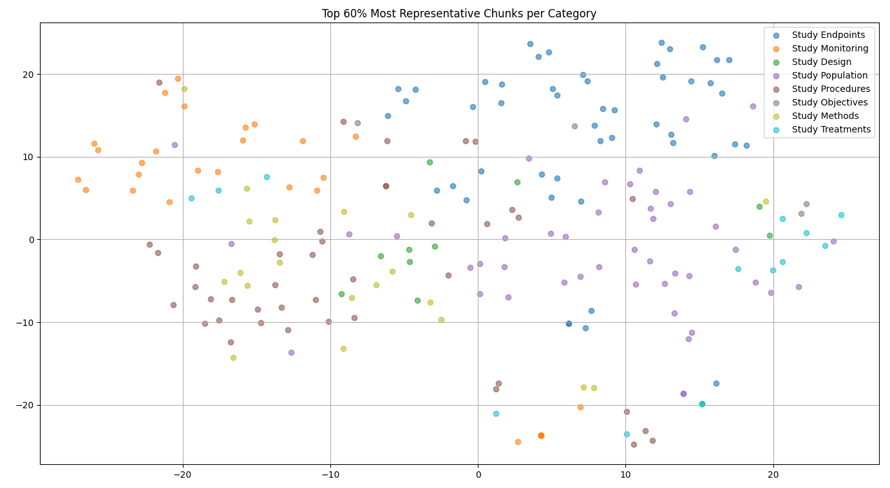

# Clinical Trial Protocol Document Summarizer

## Deliverable

Create a program to summarize CL Protocol docs (DOCX, PDF, or Plain Text) into 8 categories:
- **Study Objectives**
- **Study Endpoints**
- **Study Design**
- **Study Population**
- **Study Treatments**
- **Study Procedures**
- **Study Monitoring**
- **Study Methods**

For each topic, it compiles all information scattered throughout the report into one of the classifications. Then, using a LLM, summarizes and consolidates the amalgamation of texts into a concise and complete summary. 

---

## Process

### Trial #1:

After some planning, the initial pipeline included 3 steps.
1. Parsing using some document universal python library, and breaking the entirety of the text into fragments.
2. Taking those fragments, and using a [zero-shot classifier](https://joeddav.github.io/blog/2020/05/29/ZSL.html), sort them into the 8 categories. 
3. Then finally, feeding the texts gathered into each classification and prompting a pre-trained LLM to summarize them. 

After some testing, the zero-shot classification proved not reliable enough, misclassifying greater than 1/3 of the time.

### Trial #2:

Following a few hours of research, a second pipeline was developed. I first interviewed a long-time Clinical 
Trial Manager on the practicality of the concept of the project. She said:

>"The sections of a protocol document are already well sectioned. Don't over-engineer it."

So I altered the classification process to a 3 step approach to take advantage of the pre-labeling.
1. Classifying chunks based on their section header during parse. 
2. Fringe or unlabled chunks would get [embedded](https://www.datacamp.com/blog/what-is-text-embedding-ai), then classified using cosine similarity compared to the average vector embedding for the already classified text. 
3. If any of those secondary chunks don't meet a confidence threshold, they are finally sent to a zero-shot classifier and labeled there.

This means less calls to large models, which should in turn decrease the overall time of the program.

---

## Final Pipeline

### STEP 1: Parsing with Section Processing

Loads document with PyMuPDF, then using the Table of Contents iterates over the labeled sections. If the section header is close enough to one of the 8 labels, its contents get added to the container for the chosen classification. Any sections that don't make a match are set to "Unlabeled". 

### STEP 2: Embed + Cosine Similarity

All text from the 8 categories is embedded as chunks of **150** words, then averaged. From that is calculated the category centroid, and the bottom **25%** furthest from the centroid are treated as outliers and are left out. The same will happen to the text of "Unlabeled", except rather than averaged, it's compared to the average of the 8 labels using cosine similarity, and added to the nearest match in the case of exceding the confidence threshold of **60%**. 

### STEP 3: Zero-Shot Classifier

In worst case scenario, the confidence of the previous method is too low to make a fair labeling judgment. In this case, the time expensive call is made to the bert classifier model, classifying based on its judgment if surpassing the confidence threshold of **70%**. As seen in Figure 1, the categories are not definitevly clustered following tokenization/embedding. So, if neither confidence threshold is met, the text is regarded as not important and is discarded.

### STEP 4: LLM Summary

---

IDEAS: 

A graph that shows accuracy of the summary or classifier based on chunk size, but one that also shows time

A graph for 